  ⭐ Go Backend · DevOps · Web Infrastructure · Open-source Builder ⭐

  <a href="https://go-furry.com">GoFurry Website</a> ·
  <a href="https://github.com/gofurry/gofurry-nav-site">GoFurry Monorepo</a> ·
  <a href="mailto:2660621624@qq.com">Contact</a>

---

### 🐺 Featured Project: GoFurry

A production-oriented furry culture discovery platform built and maintained as a real multi-service web system.

<table align="left" width="49%">
  <tr>
    <th colspan="2" align="center">Engineering Scope</th>
  </tr>
  <tr>
    <th width="24%">Scope</th>
    <th width="76%">Highlights</th>
  </tr>
  <tr>
    <td><strong>Architecture</strong></td>
    <td>
      Nuxt 4 public frontend / Go/Fiber APIs 
      Admin dashboard / Data collectors
    </td>
  </tr>
  <tr>
    <td><strong>Data</strong></td>
    <td>
      Furry site navigation / Steam intelligence 
      Ranking/detail/update pages
    </td>
  </tr>
  <tr>
    <td><strong>Infrastructure</strong></td>
    <td>
      Docker deployment / Nginx reverse proxy 
      PGVector / Redis / Ollama / Production scripts
    </td>
  </tr>
  <tr>
    <td><strong>Engineering</strong></td>
    <td>
      Vue SPA → Nuxt SSR migration / SEO pages 
      Service separation / Experimental RAG
    </td>
  </tr>
</table>

<table align="right" width="49%">
  <tr>
    <th colspan="2" align="center">Production Data</th>
  </tr>
  <tr>
    <th width="32%">Area</th>
    <th width="68%">Result</th>
  </tr>
  <tr>
    <td><strong>Traffic</strong></td>
    <td>
      1M+ daily-IP deduplicated visits
    </td>
  </tr>
  <tr>
    <td><strong>Community Reach</strong></td>
    <td>
      100K+ furry-community video views
    </td>
  </tr>
  <tr>
    <td><strong>Performance</strong></td>
    <td>
      Hot pages cached and refreshed 
      on schedule Site-wide APIs P99 &lt; 100ms
    </td>
  </tr>
  <tr>
    <td><strong>Security</strong></td>
    <td>
      Coraza WAF / Tencent Cloud CDN / COS 
      10M+ security/probe events retained
    </td>
  </tr>
  <tr>
    <td><strong>Operations</strong></td>
    <td>
      Production deployment Cache refresh 
      Access analysis Service monitoring
    </td>
  </tr>
</table>

 

### 🧰 Tech Stack

#### 🔹 Proficient Languages & Backend

#### 🔹 Frontend

#### 🔹 Operations

### 🎮 Steam

### 📊 GitHub Stats

  
  &nbsp;&nbsp;&nbsp;&nbsp;
  

## 🐲 Other Stats

---

### 📫 Contact Me
- Email: `2660621624@qq.com` 

